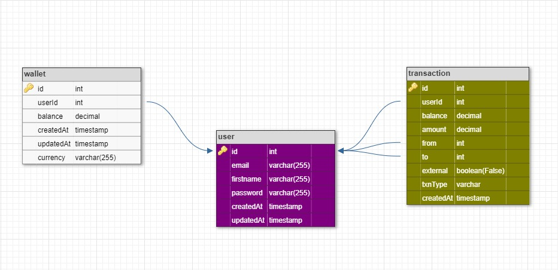

### A simple user wallet. Users can fund, withdraw or transfer money.

#### **BASE URL** - [https://lend.abuchikings.dev](https://lend.abuchikings.dev) 
#### **POSTMAN DOCS** - [https://documenter.getpostman.com/view/6026635/2s9YC7SrVG](https://documenter.getpostman.com/view/6026635/2s9YC7SrVG) 
#### **Link to project description on Google drive** - [Project description](https://drive.google.com/file/d/1k3hhh9-R_BC8VhfpSdvIsRsnv_g-g_yX/view?usp=drive_link) 

* [Technologies Used](#technologies-used)
* [Getting Started](#getting-started)
    * [Installation](#installation)
    * [Testing](#testing)
* [API-Design](#api-design)
    * [Features](#features)
    * [Data Flow and Design](#data-flow-and-design)
    * [Module Interactions](#module-interactions)
    * [API Endpoints](#api-endpoints)


## Technologies Used

* [Node.js](https://nodejs.org) - A runtime environment based off of Chrome's V8 Engine for writing Javascript code on the server.
* [MySQL](https://www.mysql.com) - An Object relational database.
* [Express.js](https://expressjs.com) - A Node.js framework.
* [Typescript](https://www.typescriptlang.org/) - Superset of Javascript.
* [Docker](hhttps://www.docker.com/) - Containerization.
* [Docker-Compose](https://docs.docker.com/compose/) - Container orchestration tool.
* [Redis](https://redis.io/) - Cache database.
* [Knexjs](https://knexjs.org/) - A NodeJS ORM for RDBMS.
* [Postman](https://www.getpostman.com/) - API testing environment.
* [Jest](https://jestjs.io/) - Javascipt Test Framework.


## Getting Started

### Installation

Ensure you have docker installed. Provided environment variables as shown in sample env. On the project root folder:

* Run `make up-d` to build and startup container.
* Run `make down` to shut down


## API Design

The purpose of this document is to provide a low level summary of the Api Backend Design. This document will cover the following: 

- Features
- Data Flow and Design
- Module Interactions
- API Endpoints


### Features

* Users can sign up for accounts.
* Users can log into their accounts.
* Users can have a wallet.
* Users can fund wallet.
* Users can transfer from wallet to other users.
* Users can withdraw from wallet.


### Data Flow and Design

 

#### Database Tables: 

```
CREATE TABLE `user` (
  `id` int unsigned NOT NULL AUTO_INCREMENT,
  `email` varchar(255) NOT NULL,
  `firstname` varchar(255) NOT NULL,
  `password` varchar(255) NOT NULL,
  `createdAt` timestamp NOT NULL DEFAULT CURRENT_TIMESTAMP,
  `updatedAt` timestamp NOT NULL DEFAULT CURRENT_TIMESTAMP,
  PRIMARY KEY (`id`),
  UNIQUE KEY `user_email_unique` (`email`),
  CONSTRAINT `user_chk_1` CHECK ((length(`email`) <= 100)),
  CONSTRAINT `user_chk_2` CHECK ((length(`firstname`) <= 50)),
  CONSTRAINT `user_chk_3` CHECK ((length(`password`) <= 1000))
) ENGINE=InnoDB AUTO_INCREMENT=2 DEFAULT CHARSET=utf8mb4 COLLATE=utf8mb4_0900_ai_ci

CREATE TABLE `wallet` (
  `id` int unsigned NOT NULL AUTO_INCREMENT,
  `userId` int unsigned NOT NULL,
  `balance` decimal(14,4) DEFAULT '0.0000',
  `createdAt` timestamp NOT NULL DEFAULT CURRENT_TIMESTAMP,
  `updatedAt` timestamp NULL DEFAULT CURRENT_TIMESTAMP,
  `currency` varchar(255) DEFAULT 'NGN',
  PRIMARY KEY (`id`),
  KEY `wallet_userid_index` (`userId`),
  CONSTRAINT `wallet_userid_foreign` FOREIGN KEY (`userId`) REFERENCES `user` (`id`) ON DELETE CASCADE
) ENGINE=InnoDB AUTO_INCREMENT=2 DEFAULT CHARSET=utf8mb4 COLLATE=utf8mb4_0900_ai_ci

CREATE TABLE `transaction` (
  `id` int unsigned NOT NULL AUTO_INCREMENT,
  `userId` int unsigned NOT NULL,
  `balance` decimal(14,4) DEFAULT '0.0000',
  `amount` decimal(14,4) DEFAULT '0.0000',
  `from` int unsigned DEFAULT NULL,
  `to` int unsigned DEFAULT NULL,
  `external` tinyint(1) DEFAULT '0',
  `txnType` varchar(255) NOT NULL,
  `createdAt` timestamp NOT NULL DEFAULT CURRENT_TIMESTAMP,
  PRIMARY KEY (`id`),
  KEY `transaction_userid_index` (`userId`),
  KEY `transaction_from_foreign` (`from`),
  KEY `transaction_to_foreign` (`to`),
  CONSTRAINT `transaction_from_foreign` FOREIGN KEY (`from`) REFERENCES `user` (`id`),
  CONSTRAINT `transaction_to_foreign` FOREIGN KEY (`to`) REFERENCES `user` (`id`),
  CONSTRAINT `transaction_userid_foreign` FOREIGN KEY (`userId`) REFERENCES `user` (`id`) ON DELETE CASCADE
) ENGINE=InnoDB DEFAULT CHARSET=utf8mb4 COLLATE=utf8mb4_0900_ai_ci
```


- A one-to-one relationship exists between the user and wallet table. This indicates that each user must have a wallet. 
- The userId column on the wallet table was indexed because most calls to the table would involve retrieving a wallet belonging to a specific user.
- A one-to-many relationship exists between the user table and the transaction table as a user would have multiple transaction records and indexing the userId field on the transaction table helps improve performance at read
- For storing user balance decimals are used as opposed to floating point or doubles which can have some accuracy problems.
- The from and to columns on the transaction table also references the user table, this way users or admin can always have a detailed transaction history.


### Module Interactions

**Cache:** Contains module that establishes connection to redis and exposes methods to interact with data in cache. This is primarily used to cache user sessions.

**Controllers:** The userController and transactionController modules are responsible for handling requests from routes and returning response to the user. 

**Middlewares:** This provides a request handler functions for authorization and user input validation. 

**Routes:** Contains the index route and routes modules to access controller methods. Request handler functions including controller methods are called here. 

**Services:** The services provide database access to controllers. This contains the queries which are used to manipulate data in the database.

**Utils:** Contains data type definitions, interfaces for objects and functions to handle responses to users.

**App Module:** Contains instantiation for express and middleware for cors, parsing json.

**Server Module:** Application entry point. Set up a server to listen on port. 


### API Endpoints

* POST Signup User                  (/auth/signup)
* POST Login User                   (/auth/login)
* POST Fund Wallet                  (/transaction/fund)
* POST Transfer Funds               (/transaction/transfer)
* POST Withdraw From Wallet         (/transaction/withdraw/)
